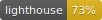
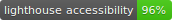

# Storyscript Studio

[](https://app.netlify.com/sites/studio-storyscript/deploys)
[](https://codecov.io/gh/storyscript/studio)
[](https://studio.storyscript.io)

[](http://commitizen.github.io/cz-cli/)
[](https://percy.io/Storyscript/studio)

[](https://github.com/storyscript/.github/blob/master/CODE_OF_CONDUCT.md)

## Project commands

```bash
# Install dependencies
$> yarn install

# Start a dev server with HMR
$> yarn serve

# Build for production
$> yarn build

# Run unit tests with coverage
$> yarn test:unit

# Run integration tests without browser
$> yarn test:integration-headless

# Run integration tests with browser
$> yarn test:integration

# Commit using commitizen
$> yarn commit

# Bump version and generates CHANGELOG.md
$> yarn release

# Generates badges for lighthouse rating
$> yarn pwa-audit

# Run integration with Percy report
$> yarn percy

# Starts only the studio, made mostly for integrations tests
$> yarn stack:studio
```

## Lighthouse Score

[](https://github.com/GoogleChrome/lighthouse)

[](https://studio.storyscript.io)
[](https://studio.storyscript.io)
[](https://studio.storyscript.io)
[](https://studio.storyscript.io)
[](https://studio.storyscript.io)
